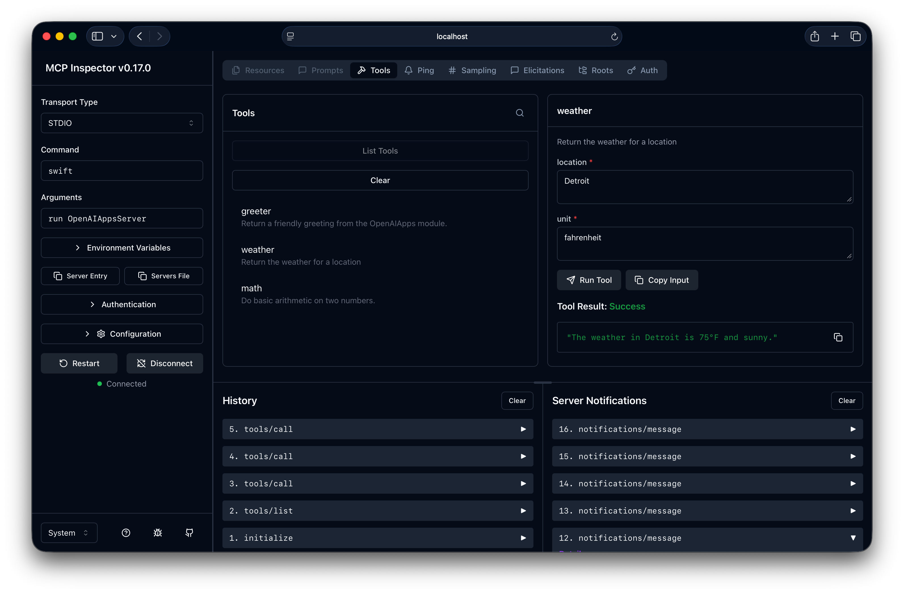
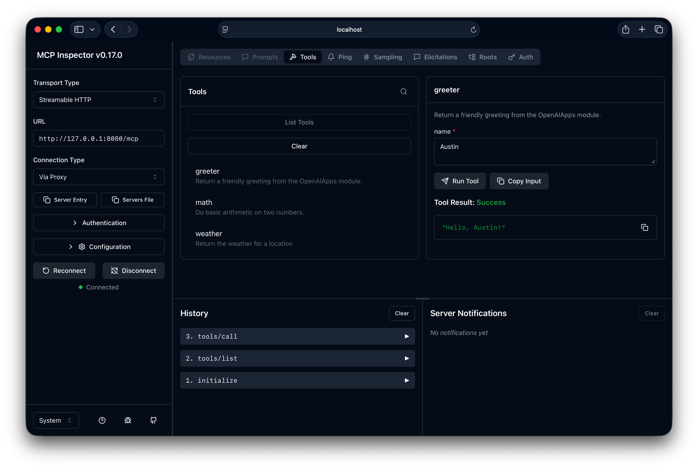

# swift-mcp-toolkit

[](https://github.com/ajevans99/swift-mcp-toolkit/actions/workflows/ci.yml)
[](https://swiftpackageindex.com/ajevans99/swift-mcp-toolkit)
[](https://swiftpackageindex.com/ajevans99/swift-mcp-toolkit)

A toolkit built on top of the [official Swift SDK for Model Context Protocol server and clients](https://github.com/modelcontextprotocol/swift-sdk) that makes it easy to define strongly-typed tools.

## Quick Start

### Step 1: Define a Tool

Conform to `MCPTool`, describe your parameters using the JSONSchemaBuilder or @Schemable from [`swift-json-schema`](https://github.com/ajevans99/swift-json-schema), and implement the `call(with:)` method.

```swift
struct WeatherTool: MCPTool {
  let name = "weather"
  let description: String? = "Return the weather for a location"

  @Schemable
  enum Unit {
    case fahrenheit
    case celsius
  }

  @Schemable
  @ObjectOptions(.additionalProperties { false })
  struct Parameters {
    /// Location as city, like "Detroit" or "New York"
    let location: String

    /// Unit for temperature
    let unit: Unit
  }

  func call(with arguments: Parameters) async throws(ToolError) -> Content {
    switch arguments.unit {
    case .fahrenheit:
      "The weather in \(arguments.location) is 75°F and sunny."
    case .celsius:
      "The weather in \(arguments.location) is 24°C and sunny."
    }
  }
}
```

<details>
<summary>Compare to see the vanilla <code>swift-sdk</code> approach</summary>

```swift
// Example/Sources/MCPToolkitExample/Tools/VanillaWeatherTool.swift
import MCP

struct VanillaWeatherTool {
  static let name = "weather"

  static func configure(server: Server) async {
    await server.withMethodHandler(ListTools.self) { _ in
      let tools = [
        Tool(
          name: Self.name,
          description: "Return the weather for a location",
          inputSchema: .object([
            "type": .string("object"),
            "additionalProperties": .bool(false),
            "properties": .object([
              "location": .object([
                "type": .string("string"),
                "description": .string("Location as city, like \"Detroit\" or \"New York\""),
              ]),
              "unit": .object([
                "type": .string("string"),
                "enum": .array(["fahrenheit", "celsius"].map { .string($0) }),
                "description": .string("Unit for temperature"),
              ]),
            ]),
            "required": .array([.string("location"), .string("unit")]),
          ])
        )
      ]
      return .init(tools: tools)
    }

    await server.withMethodHandler(CallTool.self) { params async in
      guard let arguments = params.arguments else {
        return .init(
          content: [.text("Missing arguments for tool \(Self.name)")],
          isError: true
        )
      }

      guard
        case .string(let location)? = arguments["location"],
        case .string(let unit)? = arguments["unit"]
      else {
        return .init(
          content: [.text("Arguments for tool \(Self.name) failed validation.")],
          isError: true
        )
      }

      let summary: String
      switch unit {
      case "fahrenheit":
        summary = "The weather in \(location) is 75°F and sunny."
      case "celsius":
        summary = "The weather in \(location) is 24°C and sunny."
      default:
        return .init(
          content: [.text("Arguments for tool \(Self.name) failed validation.")],
          isError: true
        )
      }

      return .init(content: [.text(summary)])
    }
  }
}
```

</details>

### Step 2: Register the Tool with a MCP Server

Create the same `Server` instance you would when using the `swift-sdk`, then call `register(tools:)` with your tool instance(s).
The optional `messaging:` parameter lets you customise every toolkit-managed response if you want to adjust tone, add metadata, or localise error messages.

```swift
import MCPToolkit

let server = Server(
  name: "Weather Station",
  version: "1.0.0",
  capabilities: .init(tools: .init(listChanged: true))
)

await server.register(
  tools: [WeatherTool()],
  messaging: ResponseMessagingFactory.defaultWithOverrides { overrides in
    overrides.toolThrew = { context in
      CallTool.Result(
        content: [
          .text("Weather machine failure: \(context.error.localizedDescription)")
        ],
        isError: true
      )
    }
  }
)
```

If you are happy with the toolkit's defaults, simply omit the `messaging:` argument.

### Error Handling

The toolkit provides automatic error handling for tools. Any error thrown from `call(with:)` will be automatically converted to an error response with `isError: true`.

For custom error messages with structured content, throw a `ToolError`:

```swift
struct ValidatedTool: MCPTool {
  let name = "validated"

  @Schemable
  struct Parameters {
    let value: Int
  }

  func call(with arguments: Parameters) async throws(ToolError) -> Content {
    guard arguments.value > 0 else {
      throw ToolError {
        "Invalid input: value must be positive"
        "Received: \(arguments.value)"
        "Please provide a value greater than 0"
      }
    }

    return ["Success! Value is \(arguments.value)"]
  }
}
```

The `ToolError` supports the same `@ToolContentBuilder` syntax as the `Content` return type, allowing you to provide rich, multi-line error messages.

For simple single-line errors, use the convenience initializer:

```swift
throw ToolError("Value must be positive")
```

<details>
<summary><strong>Structured Output Tools</strong></summary>

For tools that need to return both structured data and human-readable content, use `MCPToolWithStructuredOutput`. This is useful when clients need machine-readable data alongside text descriptions.

```swift
import MCPToolkit

struct WeatherTool: MCPToolWithStructuredOutput {
  let name = "get_weather"
  let description = "Get current weather conditions"

  @Schemable
  struct Parameters {
    let location: String
    let units: String? = "celsius"
  }

  @Schemable
  struct Output {
    let temperature: Double
    let conditions: String
    let humidity: Int
    let windSpeed: Double
  }

  func produceOutput(with arguments: Parameters) async throws(ToolError) -> Output {
    // Fetch weather data from an API
    let data = try await weatherAPI.fetch(
      location: arguments.location,
      units: arguments.units ?? "celsius"
    )

    return Output(
      temperature: data.temp,
      conditions: data.description,
      humidity: data.humidity,
      windSpeed: data.windSpeed
    )
  }

  func content(for output: Output) throws(ToolError) -> Content {
    "🌡️ Temperature: \(output.temperature)°"
    "☁️ Conditions: \(output.conditions)"
    "💧 Humidity: \(output.humidity)%"
    "💨 Wind Speed: \(output.windSpeed) m/s"
  }
}
```

The `content(for:)` method is optional. If you only need structured output without text content, you can omit it:

```swift
struct DataTool: MCPToolWithStructuredOutput {
  let name = "get_data"
  
  @Schemable
  struct Parameters {
    let query: String
  }
  
  @Schemable
  struct Output {
    let results: [Result]
    let count: Int
  }
  
  func produceOutput(with arguments: Parameters) async throws(ToolError) -> Output {
    let results = try await database.query(arguments.query)
    return Output(results: results, count: results.count)
  }
  
  // No content(for:) needed - purely structured output
}
```

The structured output is automatically validated against your `Output` schema and included in the tool response.

</details>

## Running the Example Server with MCP Inspector

[MCP Inspector](https://modelcontextprotocol.io/docs/tools/inspector) is an interactive development tool for MCP servers.

To install MCP Inspector, run:

```bash
npm install -g @modelcontextprotocol/inspector
```

Then you can run the [example cli](./Example) with either stdio or HTTP transport modes.

### Stdio

To run the example server with stdio transport, use:

```bash
npx @modelcontextprotocol/inspector@latest swift run MCPToolkitExample --transport stdio
```

This will start the server and connect it to MCP Inspector.



### HTTP

In HTTP mode, the CLI will spin up a [Vapor web server](https://vapor.codes) (on port 8080 by default) with MCP tools at `/mcp` endpoint.

First start the Vapor server:

```bash
swift run MCPToolkitExample --transport http
```

Then in another terminal, start MCP Inspector and connect to the server:

```bash
npx @modelcontextprotocol/inspector@latest --server-url http://127.0.0.1:8080/mcp --transport http
```



## Resources

MCP Resources allow servers to expose data that clients can read. This is useful for providing context like documentation, configuration files, or dynamic content.

### Defining a Resource

Conform to `MCPResource` and use the `@ResourceContentBuilder` to define your content declaratively:

```swift
import MCPToolkit

struct DocumentationResource: MCPResource {
  let uri = "docs://api/overview"
  let name: String? = "API Overview"
  let description: String? = "Complete API documentation"
  let mimeType: String? = "text/markdown"

  var content: Content {
    """
    # API Documentation

    Welcome to our API!
    """
  }
}
```

### Multiple Content Blocks

Use `Group` to combine multiple strings with optional custom separators and MIME types:

```swift
struct HTMLPageResource: MCPResource {
  let uri = "ui://widget/page.html"
  let name: String? = "Widget Page"

  var content: Content {
    // HTML content with default newline separator
    Group {
      "<!DOCTYPE html>"
      "<html>"
      "<head><title>My Widget</title></head>"
      "<body><h1>Hello!</h1></body>"
      "</html>"
    }
    .mimeType("text/html")

    // CSS with custom separator
    Group(separator: " ") {
      ".widget { color: blue; }"
      ".title { font-size: 20px; }"
    }
    .mimeType("text/css")
  }
}
```

### Binary Blobs

Resources can provide binary content (images, PDFs, etc.) as base64-encoded strings:

```swift
struct ImageResource: MCPResource {
  let uri = "data://images/logo.png"
  let name: String? = "Company Logo"

  var content: Content {
    // Provide base64-encoded binary data
    let base64PNG = "iVBORw0KGgoAAAANSUhEUgAAAAEAAAAB..."
    ResourceContentItem.blob(base64PNG, mimeType: "image/png")
  }
}

// Mix text and binary content
struct DocumentWithImagesResource: MCPResource {
  let uri = "doc://report"

  var content: Content {
    Group {
      "# Monthly Report"
      "See the chart below."
    }
    .mimeType("text/markdown")

    // Embed a chart image
    ResourceContentItem.blob(chartImageBase64, mimeType: "image/png")

    Group {
      "## Summary"
      "Data shows positive trends."
    }
    .mimeType("text/markdown")
  }
}
```

### Registering Resources

Register resources with your MCP server just like tools:

```swift
let server = Server(
  name: "Documentation Server",
  version: "1.0.0",
  capabilities: .init(resources: .init(listChanged: true))
)

await server.register(resources: [
  DocumentationResource(),
  HTMLPageResource(),
  ImageResource()
])
```

## Documentation

Full API documentation is available on Swift Package Index [here](https://swiftpackageindex.com/ajevans99/swift-mcp-toolkit/main/documentation/mcptoolkit).

## Installation

### Swift Package Manager

Add `swift-mcp-toolkit` to your `Package.swift`:

```swift
dependencies: [
  .package(url: "https://github.com/ajevans99/swift-mcp-toolkit.git", from: "0.1.0")
]
```

Then add the dependency to your target:

```swift
.target(
  name: "YourTarget",
  dependencies: [
    .product(name: "MCPToolkit", package: "swift-mcp-toolkit")
  ]
)
```

## Contributing

We welcome contributions! Please see [CONTRIBUTING.md](CONTRIBUTING.md) for guidelines.

## License

This project is licensed under the MIT License. See [LICENSE](LICENSE) for details.

## Resources

- [MCP Official Documentation](https://modelcontextprotocol.io/docs)
- [Example MCP Servers](https://github.com/modelcontextprotocol/servers)
- [Swift SDK - MCP](https://github.com/modelcontextprotocol/swift-sdk)
- [Swift JSON Schema](https://github.com/ajevans99/swift-json-schema)
